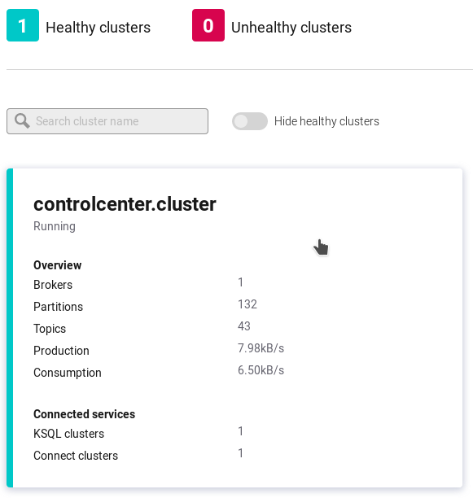
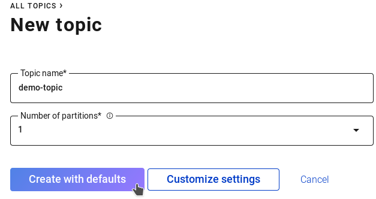
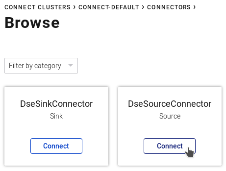
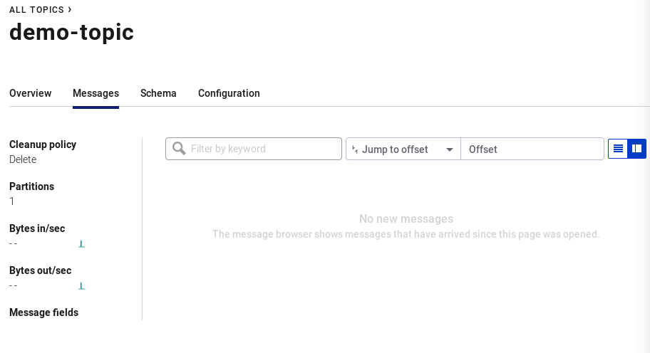

# DataStax CDC for Apache Kafka

Below is a guide for running and validating the DataStax Enterprise CDC
Connector for Apache Kafka. This builds on the excellent foundation of the
DataStax Apache Kafka Connector by adding CDC functionality as a Source
Connector.

## Install Dependencies

1. Install Docker
2. Install Docker Compose
3. Check out a copy of this repository
4. Download kafaka-connect-dse-2.0.0-20190925-LABS.jar from [DataStax
   Labs](https://downloads.datastax.com/#labs) and place it within this
   directory.

## Start the DataStax Enterprise and Apache Kafka Components

Note that the Source functionality of this connector will **ONLY** work with a
specific Labs Edition build of DataStax Enterprise 6.8.0. This build is
currently only available as a Docker container at
[datastaxlabs/dse-cdc-server](https://hub.docker.com/r/datastaxlabs/dse-cdc-server).
This container is referenced in the Docker Compose [configuration
file](https://github.com/datastax/labs/blob/master/kafka-connector-cdc/docker-compose.yml)
in this directory. This container does not have to be run within Docker compose,
it's included here as a way to ease testing efforts. 

This container does have modified `cassandra.yaml` and `dse.yaml` files.
`cassandra.yaml` has been tuned to reduce the periodic commit log sync to 500ms
and enable CDC. `dse.yaml` has DSE Advanced Replication enabled.

1. Start up the stack `docker-compose up -d`

If for some reason a component does not come up due to the order of containers
being started try running the command again.

## Configure DataStax Enterprise for Replication to Kafka
DataStax Enterprise Advanced Replication underpins the deduplication and
replication of mutations for a set of source tables, through a replication
channel, and to a destination. In this setup we must create a keyspace and table
to write messages to. Followed by a DSE Advanced Replication Destination and
Channel.

1. Configure DSE schema 

   ```
   docker-compose exec dse cqlsh
   ```

   ```
   CREATE KEYSPACE demo_ks WITH replication = {'class': 'NetworkTopologyStrategy', 'dc1': 1};
   CREATE TABLE demo_ks.demo_table (
     k TEXT,
     v TEXT,
     PRIMARY KEY ((k))
   );
   ```

2. Enable DSE Advanced Replication Destination for Kafka

   ```
   docker-compose exec dse dse advrep destination create --name demo_destination --transmission-enabled true
   docker-compose exec dse dse advrep destination list
   ```

3. Enable DSE Advanced Replication Channel for `demo_ks.demo_table`

   ```
   docker-compose exec dse dse advrep channel create --data-center-id dc1 --source-keyspace demo_ks --source-table demo_table --destination demo_destination --transmission-enabled true --collection-enabled true
   docker-compose exec dse dse advrep channel status
   ```

## Configure Kafka and the Connector
With everything configured within DSE it is now time to create a topic to
receive our mutations and an instance of the connector to process the CDC
messages.

1. Connect to the Confluent Control Panel http://localhost:9021/
2. Select the only cluster

   

3. Click "_Topics_" in the left sidebar

    

4. Click "_Add a topic_" in the top right corner
5. Enter the following parameters then click "_Create with defaults_"

    **Topic name:** demo-topic **Number of partitions:** 1

    

6. Open "_Connect_" in the left sidebar
7. Click "_connect-default_"
8. Click "_Add Connector_"
9. Click "_Connect_" under "_DseSourceConnector_"

   

10. Enter the following parameters and click "_Continue_"

    **Name:** demo-connector **Tasks max:** 1 **Key converter class:**
    JsonConverter **Value converter class:** JsonConverter **topic:** demo-topic
    **destination:** demo_destination **contact_points:** dse

     

11. Verify configuration parameters and click "_Launch_"

    

## Insert data to be replicated
1. Start `cqlsh` and insert data

    ```
    docker-compose exec dse cqlsh
    ```

    ```
    INSERT INTO demo_ks.demo_table (k, v) VALUES ('a', 'b');
    INSERT INTO demo_ks.demo_table (k, v) VALUES ('c', 'd');
    INSERT INTO demo_ks.demo_table (k, v) VALUES ('e', 'f');
    ```

## Validate behavior

1. Look in to number of messages waiting to be replicated

    ```
    docker-compose exec dse dse advrep replog count --source-keyspace demo_ks --source-table demo_table --destination demo_destination
    ```
2. Navigate to the topic view in the confluent control center
3. Click "_Topics_" in the left side bar
4. Select "_demo-topic_" from the list
5. Validate messages are being produced and consumed
6. Optionally look at the messages

   

   Note the record structure:

   * Key: JSON object representing all primary key columns
   * Value: JSON object representing all non-primary key columns
   * Timestamp: Microsecond timestamp of the mutation converted to milliseconds
   * Headers: Includes the keyspace name, table name, and replication type
     (INSERT, UPDATE, or DELETE)
